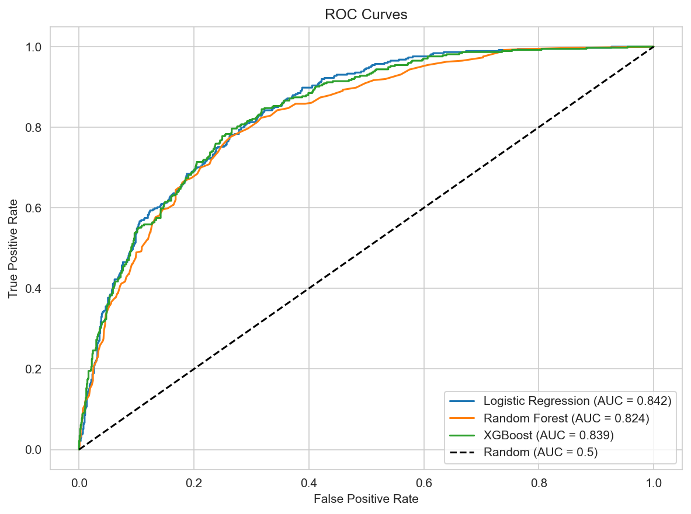
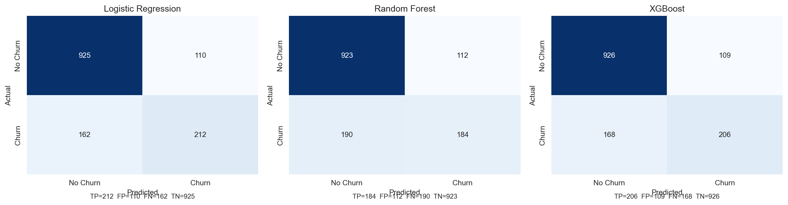
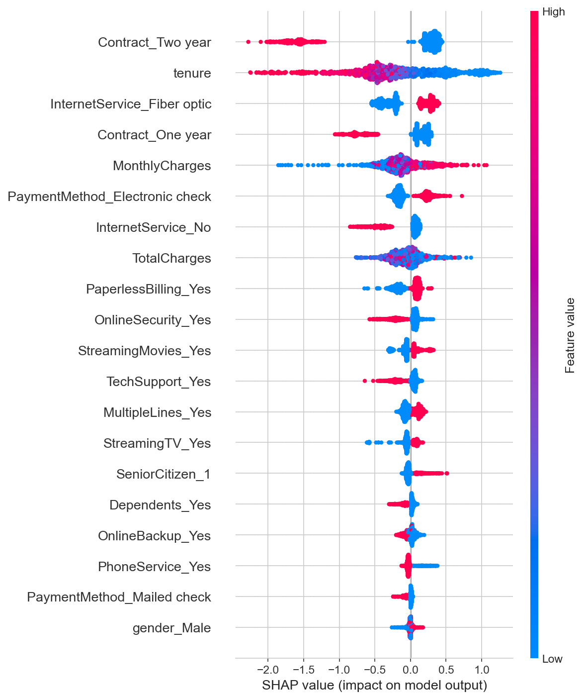

<div align="center">
  
  
  
  
  
  
  <br>
  
  
  
</div>

<br>

<h1 align="center">
  Customer Churn Prediction
</h1>

<p align="center">
  <strong>A production-grade ML classifier that identifies at-risk telecom customers with 79% recall.</strong>
</p>

<p align="center">
  <a href="https://churn-prediction-dtb6znoxdw9diydx4gwbfu.streamlit.app/" target="_blank">
    
  </a>
  &nbsp;
  <a href="#quick-start" target="_blank">
    
  </a>
</p>

---

## The Problem

Telecom providers hemorrhage **26.5% of their customer base** every year. Each lost subscriber represents months of forfeited recurring revenue plus the cost of acquiring someone new. Most companies discover the problem *after* the customer has already left.

This project builds a system that catches churn **before it happens** — flagging high-risk subscribers so retention teams can act.

**The bottom line:** The model catches 4 out of 5 eventual churners, giving the business a real window to intervene.

---

## What It Does

| Input | Output |
|---|---|
| 19 customer attributes (demographics, account details, service subscriptions) | Churn probability (0–100%) |
| Real-time via sidebar form or batch CSV upload | Risk classification (Stay / Churn) |
| &nbsp; | Per-customer risk factor breakdown |
| &nbsp; | Session history with CSV export |

---

## Model Performance

| Model | Accuracy | Precision | Recall | F1 | AUC |
|---|---|---|---|---|---|
| Logistic Regression (tuned) | 73.9% | 50.5% | 78.1% | 0.613 | 0.841 |
| Random Forest (tuned) | 76.7% | 54.5% | 73.8% | 0.627 | 0.839 |
| **XGBoost (tuned) — deployed** | **75.1%** | **52.0%** | **78.9%** | **0.627** | **0.842** |

<p align="center">
  
  
</p>

The deployed XGBoost model correctly identifies **78.9% of all churners** while maintaining 52% precision. At this operating point, the model delivers a **2× lift** over the 26.5% base churn rate — meaning flagged customers are twice as likely to churn as the average subscriber.

---

## What Drives Churn

SHAP analysis reveals the five features that most strongly influence the model's decisions:

<p align="center">
  
</p>

| Factor | Impact |
|---|---|
| **Contract type** | Month-to-month customers churn at 42.7% vs 2.8% for two-year contracts |
| **Tenure** | 80% of churn happens in the first 10 months — the critical retention window |
| **Internet service** | Fiber optic subscribers churn at roughly twice the rate of DSL users |
| **Payment method** | Electronic check payers are the highest-risk segment by payment type |
| **Monthly charges** | Every $10 increase correlates with a measurable rise in churn probability |

---

## Architecture

```
┌────────────────────────────────────────────────────────────────────┐
│                        Data Pipeline                               │
│                                                                    │
│  Raw CSV ──► Clean ──► Feature Engineer ──► Train/Test Split      │
│  (7,043 rows)   │        │                      │                 │
│                  │        │                      │                 │
│                  ▼        ▼                      ▼                 │
│           Drop ID    One-hot encode        80% Train / 20% Test   │
│           Impute     StandardScaler                               │
│           Cast                                                   │
└────────────────────────────────────────────────────────────────────┘
                                    │
                                    ▼
┌────────────────────────────────────────────────────────────────────┐
│                        Model Training                              │
│                                                                    │
│  GridSearchCV (5-fold, F1-optimized)                              │
│  ┌──────────┬──────────────────────────────────────┐              │
│  │ Baseline │ Logistic Regression                  │              │
│  │ Ensemble │ Random Forest                        │              │
│  │ Boosted  │ XGBoost ← selected for production   │              │
│  └──────────┴──────────────────────────────────────┘              │
└────────────────────────────────────────────────────────────────────┘
                                    │
                                    ▼
┌────────────────────────────────────────────────────────────────────┐
│                        Deployment                                  │
│                                                                    │
│  ┌──────────┐    ┌──────────┐    ┌──────────────────┐            │
│  │ model.pkl│───►│ scaler   │───►│ Streamlit App    │            │
│  │ preproc  │    │ .pkl     │    │ (live inference) │            │
│  └──────────┘    └──────────┘    └──────────────────┘            │
└────────────────────────────────────────────────────────────────────┘
```

---

## Quick Start

### Prerequisites
- Python 3.11+
- pip

### Setup

```bash
# Clone the repository
git clone https://github.com/surya1805coder-gif/churn-prediction.git
cd churn-prediction

# Install dependencies
pip install -r requirements.txt

# Train artifacts and export model files
python save_artifacts.py

# Launch the application
streamlit run app.py
```

Open **http://localhost:8501** in your browser. Enter customer details in the sidebar and click **Predict Churn**.

### Explore the Pipeline

The complete ML workflow is documented cell-by-cell in the Jupyter notebook:

```bash
jupyter notebook Churn_Prediction.ipynb
```

---

## Project Structure

```
churn-prediction/
│
├── app.py                  # Streamlit application — live inference UI
├── save_artifacts.py        # Train & export model, scaler, preprocessor
├── Churn_Prediction.ipynb   # Full ML pipeline (33 cells, step-by-step)
├── requirements.txt         # Python dependencies
│
├── data/                    # Raw and processed CSV datasets
├── models/                  # Serialized artifacts (committed for deployment)
│   ├── model.pkl            # Trained XGBoost classifier
│   ├── scaler.pkl           # Fitted StandardScaler
│   └── preprocessor.pkl     # Feature columns, categoricals, metadata
│
└── assets/                  # Evaluation plots
    ├── roc_curves.png
    ├── confusion_matrices.png
    ├── shap_summary.png
    ├── feature_importance.png
    └── ...
```

---

## Tech Stack

| Category | Technologies |
|---|---|
| **Language** | Python 3.13 |
| **Data** | pandas, numpy |
| **Modeling** | XGBoost, scikit-learn (LogisticRegression, RandomForestClassifier) |
| **Tuning** | GridSearchCV (5-fold cross-validation, F1 scoring) |
| **Interpretation** | SHAP (TreeExplainer, summary plots, force plots) |
| **Frontend** | Streamlit |
| **Serialization** | joblib |
| **Notebook** | Jupyter |

---

## Live Demo

The application is deployed on Streamlit Community Cloud and ready to use:

<a href="https://churn-prediction-dtb6znoxdw9diydx4gwbfu.streamlit.app/" target="_blank">
  
</a>

---

## License

This project uses the [IBM Telco Customer Churn Dataset](https://www.kaggle.com/datasets/blastchar/telco-customer-churn) available under CC0.

---

<p align="center">
  <sub>Built with Python, XGBoost, and Streamlit.</sub>
</p>
